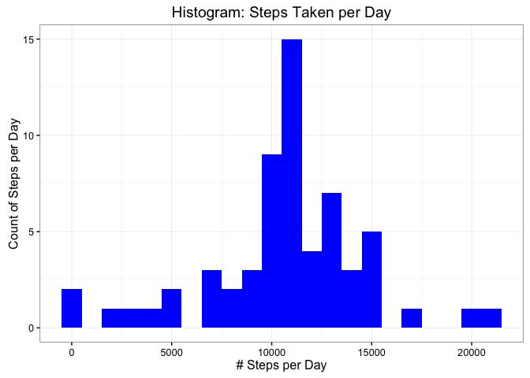

# Reproducible Research: Peer Assessment 1


```r
# Load libraries
library(ggplot2)
```

```
## Warning: package 'ggplot2' was built under R version 3.2.4
```

```r
# Set some options for knitr
knitr::opts_chunk$set(tidy=FALSE, fig.path='figure/')
```

## Loading and preprocessing the data

The data was provided in a CSV file containing three columns: **steps** (number of steps taking in a 5-minute interval with missing values coded as NA), **date** (the date on which the measurement was taken in YYYY-MM-DD format), and **interval** (identifier for the 5-minute interval in which measurement was taken).


```r
# If the CSV file doesn't exist, extract it
if (!file.exists("activity.csv")) {
    # Just in case, if the ZIP file doesn't exist, download it
    if (!file.exists("activity.zip")) {
        download.file(
            "https://d396qusza40orc.cloudfront.net/repdata%2Fdata%2Factivity.zip", 
            "activity.zip")
    }
    unzip("activity.zip")
}

# Load the data
activity <- read.csv("activity.csv", stringsAsFactors = FALSE)

# Change the class of the date variable to Date
activity$date <- as.Date(activity$date)
```

This is what the data looks like:


```r
head(activity)
```

```
##   steps       date interval
## 1    NA 2012-10-01        0
## 2    NA 2012-10-01        5
## 3    NA 2012-10-01       10
## 4    NA 2012-10-01       15
## 5    NA 2012-10-01       20
## 6    NA 2012-10-01       25
```

## What is mean total number of steps taken per day?


```r
# Calculate daily sums
daily_steps <- aggregate(formula = steps~date, data = activity,
                         FUN = sum, na.rm = TRUE)

# Show histogram
ggplot(daily_steps, aes(x = steps)) + 
       geom_histogram(fill = "blue", binwidth = 1000) + 
        labs(title="Histogram: Steps Taken per Day", 
             x = "# Steps per Day", y = "Count of Steps per Day") + theme_bw() 
```

<!-- -->

```r
# Calculate mean and median
mean_steps <- format(mean(daily_steps$steps), big.mark = ",", big.interval = 3)
median_steps <- format(median(daily_steps$steps), big.mark = ",", 
                       big.interval = 3)
```

The mean daily steps is 10,766.19 and the median is 10,765.

## What is the average daily activity pattern?


```r
# Aggregate the mean steps per interval
mean_steps_per_interval <- aggregate(formula=steps~interval, data=activity,
            FUN=mean, na.rm=TRUE)

ggplot(mean_steps_per_interval, aes(x=interval, y=steps)) +   
        geom_line(color="blue", size=1) +  
        labs(title="Average Daily Activity Pattern", x="Interval", y="# Steps") +  
        theme_bw()
```

<!-- -->

```r
# Get the interval with the most steps
max_interval <- mean_steps_per_interval[which.max(  
        mean_steps_per_interval$steps),]
```

Interval number 835 has the highest average number of
steps, 206.1698113.

## Imputing missing values


```r
number_missing_values <- format(length(which(is.na(activity$steps))), 
                                big.mark = ",", big.interval = 3)
```
There are 2,304 rows with missing values in the data set.

I chose to fill the missing values using the mean for the 5-minute interval.

```r
# Use the means that were calculated before
mean_steps_per_interval$steps_imputed <- floor(mean_steps_per_interval$steps)

# Merge the replacement values from above with the original data
activity_imputed <- merge(activity,
                          mean_steps_per_interval[,c('interval','steps_imputed')],
                          by = 'interval')

# Replace NA values with the mean value
activity_imputed$steps <- ifelse(is.na(activity_imputed$steps),
                           activity_imputed$steps_imputed,
                           activity_imputed$steps)

# Clean up the extraneous column
activity_imputed$steps_imputed <- NULL
```

Having completed imputing values, I re-ran the original calculations and
re-created the original histogram using this new data set.


```r
# Calculate daily sums
daily_steps_imputed <- aggregate(formula = steps~date, data = activity_imputed,
                         FUN = sum, na.rm = TRUE)

# Show histogram
ggplot(daily_steps_imputed, aes(x = steps)) + 
       geom_histogram(fill = "blue", binwidth = 1000) + 
        labs(title="Histogram: Steps Taken per Day", 
             x = "# Steps per Day", y = "Count of Steps per Day") + theme_bw() 
```

<!-- -->

```r
# Calculate mean and median
mean_steps_imputed <- format(mean(daily_steps_imputed$steps), 
                             big.mark = ",", big.interval = 3)
median_steps_imputed <- format(median(daily_steps_imputed$steps), 
                               big.mark = ",", big.interval = 3)
```

Using the imputed data set, the mean daily steps is 10,749.77 and 
the median is 10,641. Comparing to the original values, it
appears that the impact of imputing missing values is negligible, suggesting
that the missing values do not introduce bias in the original data set.

## Are there differences in activity patterns between weekdays and weekends?


```r
# Add a column to differentiate between weekends and weekdays
activity_imputed$day_type <- ifelse(as.POSIXlt(activity_imputed$date)$wday
                                       %in% c(0,6), 'weekend', 'weekday')

# Include new column in aggregation
mean_daily_steps_imputed <- aggregate(formula = steps~interval+day_type, 
                                      data = activity_imputed, FUN = mean)

# Create panel plot
ggplot(mean_daily_steps_imputed, aes(interval, steps)) + 
    geom_line() + 
    facet_grid(day_type ~ .) +
    xlab("5-Minute Interval") + 
    ylab("Avarage # of Steps")
```

<!-- -->

It seems that people start later, are still going later in the day, and (from 
eyeballing the graph) have less variation in number of steps across the 
intervals for weekend days.
